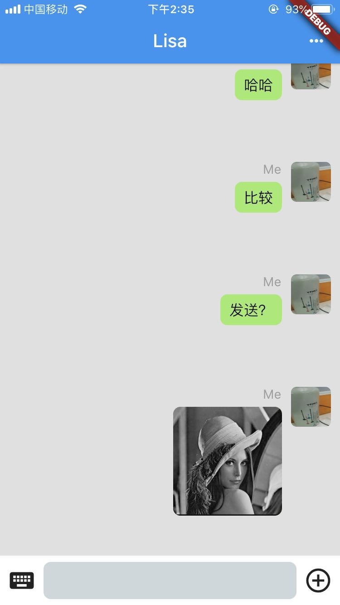

# Raven-Client(mobile)

A new Flutter project for Raven IM server.

## Related Project
IM Server:
https://github.com/IamNotShady/raven

Application Server for user and group things:

https://github.com/bbpatience/raven-appserver

Web Client:
https://github.com/bbpatience/raven-web

### Test Account
```
Test Account1:  13800222222, password: 222222
Test Account2:  13800333333, password: 333333
```
<div>


</div>

## Getting Started

This project is a starting point for a Flutter application.

A few resources to get you started if this is your first Flutter project:

- [Lab: Write your first Flutter app](https://flutter.io/docs/get-started/codelab)
- [Cookbook: Useful Flutter samples](https://flutter.io/docs/cookbook)

For help getting started with Flutter, view our 
[online documentation](https://flutter.io/docs), which offers tutorials, 
samples, guidance on mobile development, and a full API reference.
